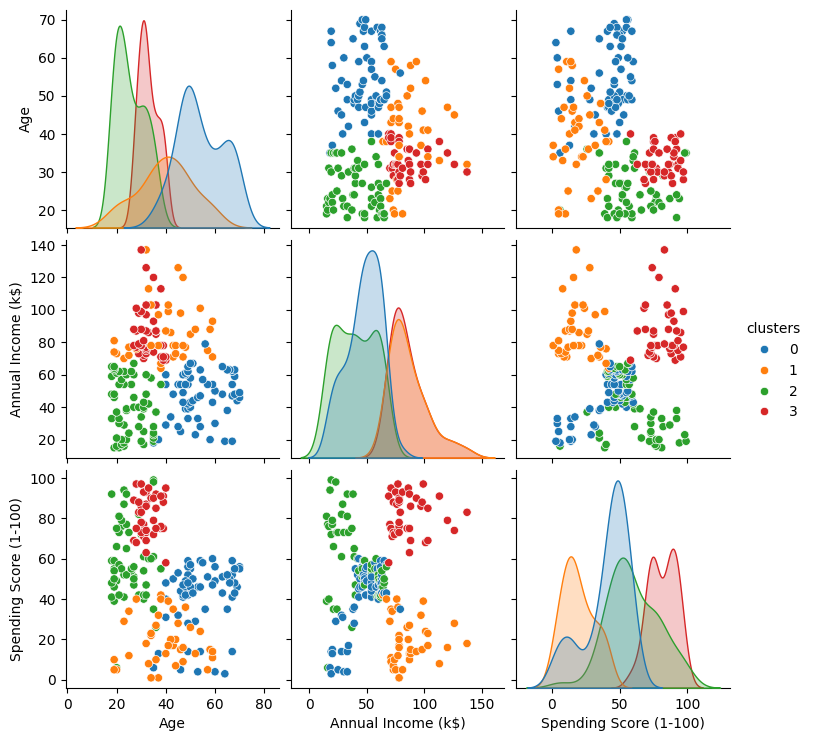
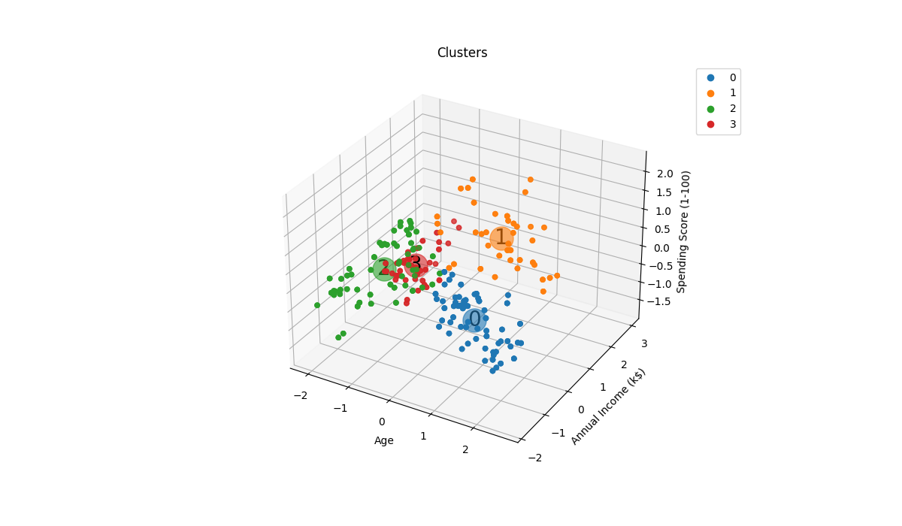
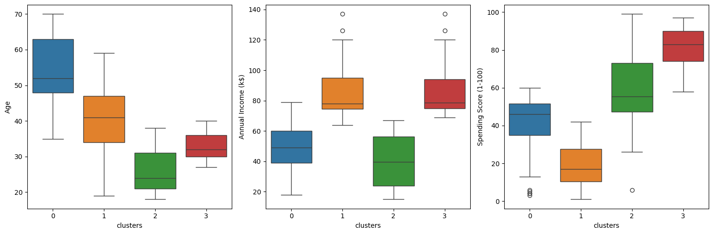

[](https://www.linkedin.com/in/zeygler-oliveira-a021a92a4/)
[](https://www.python.org/)

# Segmentação de clientes de um supermercado

Um supermercado, através de cartões de fidelidade, possui alguns dados básicos sobre seus clientes, como idade, gênero, renda anual e pontuação de gastos. Tal pontuação é algo que o supermercado atribui ao cliente com base em parâmetros definidos, como comportamento do cliente e dados de compra. O supermercado deseja entender melhor seus clientes, de modo a formular estratégias de negócios, e para isso contratou um cientista de dados para realizar uma segmentação dos clientes.


[Link original para o dataset](https://www.kaggle.com/vjchoudhary7/customer-segmentation-tutorial-in-python)


<p align="center"> 
  <a href="https://www.linkedin.com/in/zeygler-oliveira-a021a92a4/" target="_blank"></a> 
</p>




## Objetivos
Realizar a Segmentação dos Cliente com base nos dados de compra, em circustâncias reais o resultado do projeto poderia ser usado para formular estratégias de negócio.


Objetivos detalhados:

- Fazer o pré-processamento dos dados, tendo em vista que alguns algoritmos de clusterização são sensíveis a escala.
- Avaliar a separação em grupos dos dados que foram produzidos como resultado da clusterização.
- Desenvolver gráficos que podem ser utilizados em uma possível apresentação.
- Facilitar o entendimento dos dados com o objetivo de obter insights para formular estratégias.
- Boas práticas de programação e organização de códigos e notebooks. Desenvolver o conhecimento e a aplicabilidade da biblioteca SciKit-Learn, a exemplo dos pipelines.

## Estrutura do repositório

O repositório está estruturado da seguinte forma:

```
├── dados
├── imagens
├── models
├── notebooks
├── reports
```

- Na pasta `dados` estão os dados utilizados no projeto. O arquivo `Mall_Customers.csv` é o dataset utilizado originalmente. Os demais arquivos são os datasets gerados durante o projeto.
- Na pasta `imagens` estão as imagens dos gráficos desenvolvidos durante o projeto.
- Na pasta `models` estão os modelos gerados durante o projeto. 
- Na pasta `notebooks` estão os notebooks organizados do projeto:
  - [`projeto_supermercado_eda_01.ipynb`](notebooks/projeto_supermercado_eda_01.ipynb): notebook com a análise exploratória dos dados usando [ydata-profiling](reports/eda_supermercado.html) e Seaborn e você pode baixar o arquivo 'html' e abrir na guia do seu navagador e visualizar o resultado.
  - [`projeto_supermercado_preprocessing_02.ipynb`](notebooks/projeto_supermercado_preprocessing_02.ipynb): notebook com pré-processamento, definição no número de clusters a ser utilizado, clusterização e gráficos dinâmicos e iterativos.
  - [`projeto_supermercado_pca_03.ipynb`](https://nbviewer.org/github/ZeyOliveira/segmentacao_clientes_supermercado/blob/main/notebooks/projeto_supermercado_pca_03.ipynb): Foi utlizado o Pipeline como ferramenta para executar as etapas de (escalonamento, transformação de colunas categóricas, redução de dimensionalidade, e clusterização). O destaque desse notebook foi uso do PCA que ainda não havia sido visto.
  - [`funcoes_auxiliares.py`](notebooks/funcoes_auxiliares.py): arquivo com funções auxiliares utilizadas nos notebooks.
- Na pasta `reports` estão os relatórios gerados durante o projeto utilizando a biblioteca [ydata-profiling](reports/eda_supermercado.html).

## Detalhes do dataset utilizado e resumo dos resultados

O dataset utilizado é o contido no arquivo [`Mall_Customers.csv`](dados/Mall_Customers.csv), que contém os seguintes dados:

- `CustomerID`: ID do cliente
- `Gender`: Gênero do cliente
- `Age`: Idade do cliente
- `Annual Income (k$)`: Renda anual do cliente
- `Spending Score (1-100)`: Pontuação de gastos do cliente

Com o pipeline realizando pré-processamento, PCA e K-Means, a base foi segmentada em 4 clusters, como mostrado nas figuras abaixo:





- Cluster 0 - pontuação de gastos moderada, renda baixa, idade alta
- Cluster 1 - pontuação de gastos alta, renda baixa, idade jovem
- Cluster 2 - pontuação de gastos baixa, renda alta, idade moderada
- Cluster 3 - pontuação de gastos alta, renda alta, idade jovem

Transformando os pontos acima em uma tabela:

| Pontuação de Gastos | Renda    | Idade    | Cluster |
| ------------------- | -------- | -------- | ------- |
| Moderada            | Baixa    | Alta     | 0       |
| Alta                | Baixa    | Jovem    | 1       |
| Baixa               | Alta     | Moderada | 2       |
| Alta                | Alta     | Jovem    | 3       |


## Como reproduzir o projeto

O projeto foi desenvolvido utilizando o Python 3.10. Para reproduzir o projeto, crie um ambiente virtual e instale as bibliotecas abaixo:

| Biblioteca   | Versão |
| ------------ | ------ |
| Matplotlib   | 3.7.1  |
| NumPy        | 1.23.5 |
| Pandas       | 1.5.3  |
| Scikit-Learn | 1.2.2  |
| Seaborn      | 0.13.1 |

Essas são as bibliotecas principais utilizadas no projeto. O relatório foi gerado com a biblioteca [ydata-profiling](https://github.com/ydataai/ydata-profiling), instale-a se quiser reproduzir o relatório. Para ter um gráfico em 3 dimensões interativo, instale a biblioteca [ipympl](https://matplotlib.org/ipympl/).
